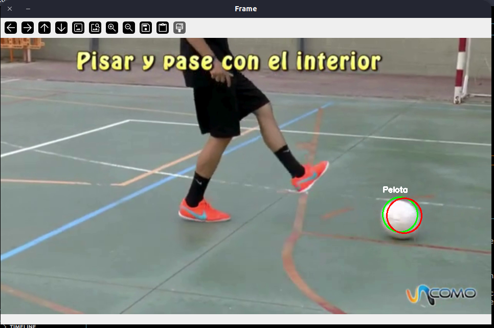

#Tarea 2. Kalman filter application
### Descripción 
Este proyecto utiliza OpenCV para detectar pelotas en un video y seguir su movimiento utilizando un filtro de Kalman. El código redimensiona el video, convierte los frames a espacio de color HSV, aplica una máscara para detectar el color blanco, y utiliza operaciones morfológicas para mejorar la detección. Finalmente, se encuentran los contornos de las pelotas y se actualiza el filtro de Kalman para predecir su posición.
### Funcionalidad 

- Inicialización del filtro de Kalman: Se configura el filtro de Kalman con matrices de medición, transición y covarianza de ruido de proceso.

- Captura de video: Se abre el archivo de video "canva.mp4" y se obtienen las dimensiones originales del video.

- Redimensionamiento del video: Se define un nuevo tamaño para mostrar el video más pequeño.

- Procesamiento de cada frame:

    -Convertir el frame a espacio de color HSV.
    -Definir el rango de color blanco en HSV.
    -Crear una máscara para el color blanco.
    -Aplicar operaciones morfológicas para mejorar la máscara.
    -Encontrar contornos en la máscara.
    -Filtrar contornos por área y circularidad.
    -Dibujar un círculo alrededor de las pelotas detectadas.
    -Actualizar y predecir la posición de las pelotas utilizando el filtro de Kalman.
    -Agregar etiquetas a las pelotas detectadas.
    -Mostrar el frame procesado: Se muestra el frame redimensionado con las pelotas detectadas y sus predicciones.

Finalización: Se muestra el video. 

[Video del funcionamiento] 
(https://www.youtube.com/watch?v=wEU9IjXsnOw)

